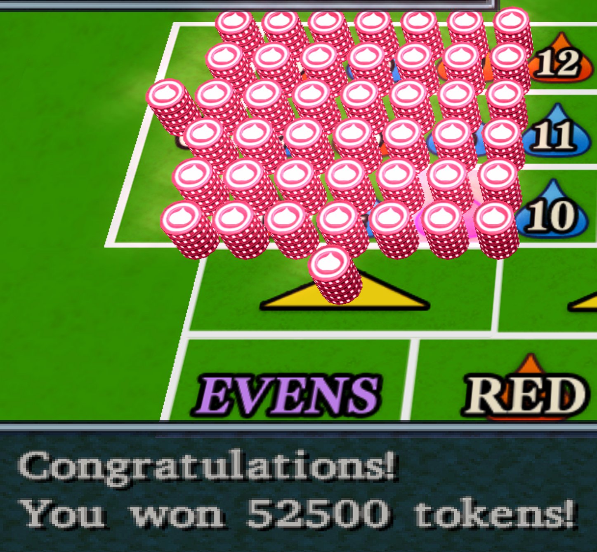
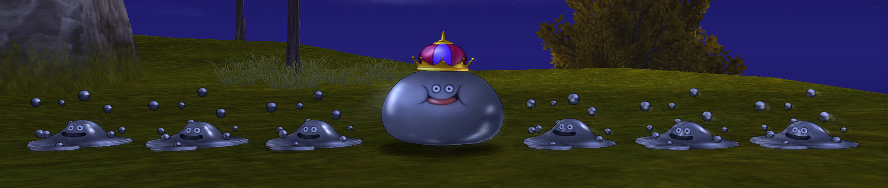
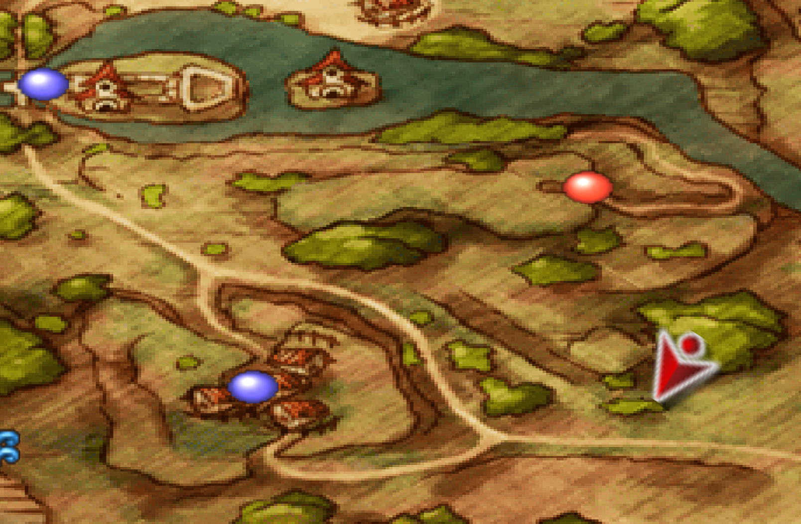
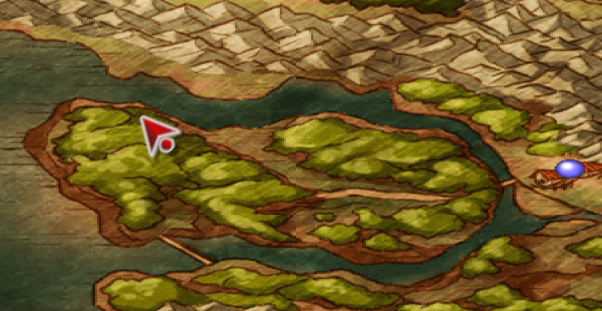
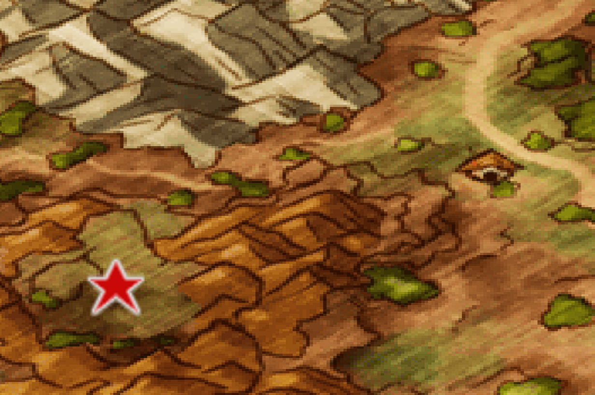
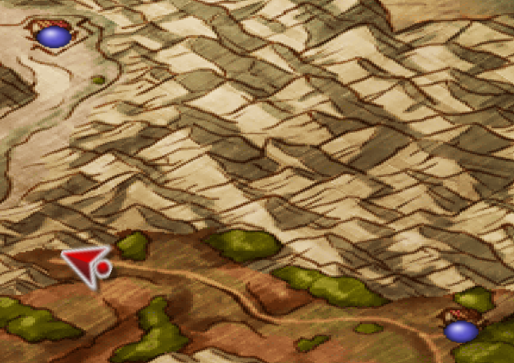
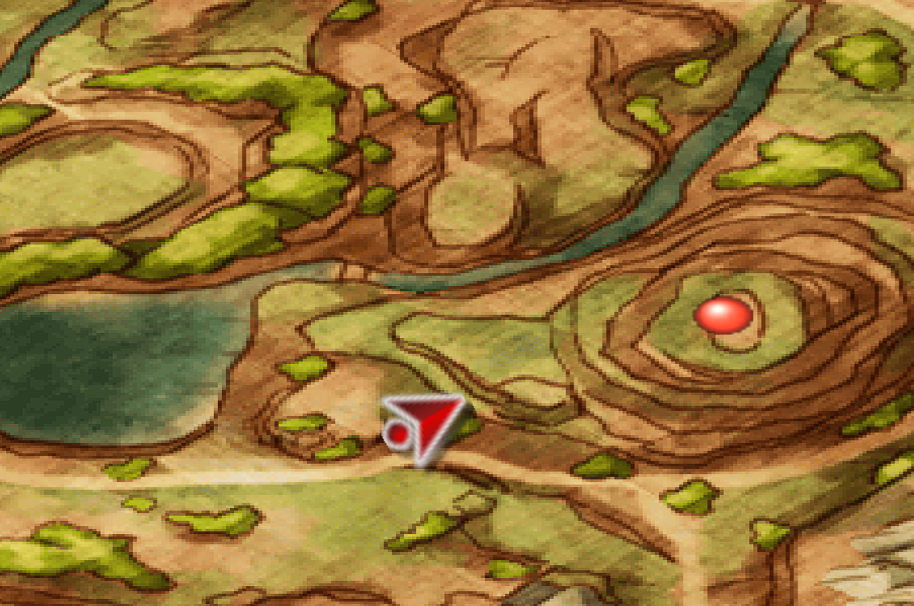

# Dragon Quest VIII - Journey of the Cursed King

Guide written by [bdjeffyp](https://retroachievements.org/User/bdjeffyp)

## Version History

- v1.0 - Initial release

 

 :no_entry: **\*\* NOTE: CONTAINS MAJOR SPOILERS FOR SOLVING ACHIEVEMENT PUZZLES \*\*** :no_entry:
 As with some of the other guides I've made, spoiler solutions for the boss strategies and a potential order to earning the achievements will be hidden in a collapsible entry that you must click to expand so that only the solutions you need assistance with will be viewable. Some of the more minor achievements will have strategies written outright without a collapsible dropdown so use the guide at your own risk.

## About

This is not an official manual, walkthrough, or critical review. This document is a guide for the current achievement set (208 as of March 11, 2024) available on [RetroAchievements](https://retroachievements.org/game/2721). This guide will give the player tips on earning the achievements, hash compatibility, and any other necessary or useful information. It may point to other resources for specific game walkthroughs that are not focused on the achievements themselves.

## Introduction

Dragon Quest VIII: Journey of the Cursed King is a role-playing video game developed by Level-5 and published by Square Enix for the PlayStation 2. Released in Japan in November 2004 and then throughout the world between 2005 and 2006, it is the eighth installment in the Dragon Quest series. It is also the first game in the series to have a release in European regions as well as the first to finally have the "Dragon Quest" name, rather than "Dragon Warrior", in the United States. Additionally, it is the first game in the series to use fully 3D environment and characters, rather than 2D pixel art. It leverages cel-shading techniques to make Akira Toriyama's character and monster designs really shine in the 3D style.

Dragon Quest VIII continues the traditional story and gameplay styles of the previous games, using small vignettes across an overarching plot, iconic monster designs, a nameless and silent hero character with hidden abilities, and randomly encountered turn-based combat with experience points. A new alchemy system is introduced to create a new item out of two or three existing stock after a certain number of steps are walked. A skill point system enables character customization, forcing the player to make permanent choices with each level around weapons and attributes that can unlock new abilities and spells.

As with other role-playing games, Dragon Quest VIII will push you into situations that can lock you out of areas, characters, and abilities as you progress. As a result, many achievements for this game can become missable if you are not diligent. However, all achievements can be earned in one playthrough. This guide will attempt to help you in identifying the missable achievements if you'd rather not play this fantastic, but lengthy, game multiple times.

## Trivia

- Dragon Quest was called "Dragon Warrior" in the United States due to a trademark conflict with a tabletop role-playing game called [DragonQuest](https://en.wikipedia.org/wiki/DragonQuest). The US trademark expired in the early 2000s and Square Enix was able to use the series name in USA for the first time once they took over the trademark.

- The series, created by Yuji Horii, was inspired by western computer role-playing games Wizardry and Ultima, while incorporating a streamlined user interface more appropriate for a console video game experience. The first Dragon Quest's user interface is based off a Famicom port of Horii's game The Portopia Serial Murder Case, which used a command menu to get user input. Horii was frustrated with text-based entry of PC text adventure games and opted to have a command menu to simplify things.

- Many monsters were designed by famed mangaka Akira Toriyama, creator of Dragon Ball and many other manga and anime series. Perhaps arguably the most iconic and widely known monster is the Slime. Horii provided Toriyama [a sketch of a slime](https://bsky.app/profile/betterlegends.bsky.social/post/3kn6x6eufh622) based on Horii's playthroughs of Wizardry and Toriyama drew the teardrop shape with a smile that we are all familiar with.

- This achievement set, created by [TheMysticalOne](https://retroachievements.org/user/TheMysticalOne), makes good use of alliteration and puns similar to the style of Dragon Quest games. Early localizations of Dragon Quest to North America lacked the punny humor of the series, but Dragon Quest VIII's localization really set the standard for future games and remakes of the older games going forward. Spells started to use onomatopoeia names (like Kaboom instead of Explodet and Woosh instead of Infernos) similar to the Japanese style for spells while monster and town names started to lean in a punny direction.

- Dragon Quest VIII was ported to mobile phones and the 3DS. The 3DS version, in particular, adds two new playable characters and a bunch of quality of life improvements such as being able to speed up battle animations and instant alchemy pot brewing as soon as the feature is unlocked.

- The western release of Dragon Quest VIII added the affect of giving Hero a "Super Saiyan" appearance when hitting max tension. The [Dragon Quest wiki](https://dragon-quest.org/wiki/Tension) states that this was added specifically to the western releases as a shout out to fans of Toriyama's work, but I could not find any other sources that confirm if that is indeed the reason.

## Save Support

The game uses PS2 memory cards to save games with 30 save slots per card. Since this is being played with the PCSX2 emulator for RetroAchievements support, it is **HIGHLY** recommended that you make use of all slots in order to minimize the possibility of being locked out of a missable achievement. You can even make more than one memory card file to make saves across multiple memory cards. In my playthrough experience, I only needed one memory card, but I used 27 slots so I got close to needing more than one memory card.

## Compatibility

Currently (as of March 11, 2024) this game has 2 unique hashes registered for it. View the linked hashes at the [Supported Game Files](https://retroachievements.org/linkedhashes.php?g=2721) page. This includes a [60fps patch](https://github.com/RetroAchievements/RAPatches/blob/main/PS2/Improvement/2721-DQ8-60FPS.zip), if that is the sort of thing you enjoy.

Please view the [Dragon Quest VIII Official Forum Topic](https://retroachievements.org/viewtopic.php?t=16644) for more details.

## Leaderboards

There are no leaderboards currently associated with the game.

## Achievement Categories
There are a currently (as of March 11, 2024) a total of 208 achievements, which can be broken down into the following categories:

- **Story/Progression**: 31 achievements earned naturally through the course of gameplay (only up to the game's normal ending)
- **Side Quest**: 28 achievements (**8 are missable**) which are unlocked from completing requests or talking to specific NPCs are certain times throughout the main adventure, including in the post game
- **Cutscene**: 17 achievements (**8 are missable**) that are earned from viewing a specific cutscene or dialogue with an NPC/party member
- **Cor Blimey**: 13 achievements (**6 are missable**), a subset of the Cutscene category, revolving around the various "COR BLIMEY" moments throughout the game.
- **Challenge**: 23 achievements (**22 are missable**) that require special action during boss fights or meet a condition throughout the entire game
- **Lists**: 36 achievements (**3 are missable**) involve progression toward and completing the various lists that are in game, such as alchemy recipes and the monster bestiary
- **Combat/Grind**: 29 achievements (**3 are missable**) that use actions taken by characters in battle a specific number of times or may require multiple battles to meet the requirements, as well as skill point category maxing
- **Item Exchange**: 6 achievements, a subset of the Lists category, for Dodgy Dave and Princess Minnie, exchanging the specific alchemy items and mini medals for certain rewards
- **Monster Arena**: 8 achievements, a subset of the Side Quest category, for advancing in the monster arena and other arena related quests
- **Treasure**: 17 achievements (**3 are missable**) which require finding all treasure chests in a given region or dungeon

Out of all of the achievements, a total of **53 are missable**

## Potential Order
<!--TODO: Determine the order for the achievements. Note that the set is arranged for a lot of stuff to be accomplished throughout the story but then a bunch of others at the bottom that can be mixed in during the completion of the story.-->
The following is a breakdown of the order of achievements based on my personal playthrough. Note that your mileage may vary due to the path you may desire to take, such as getting Odin before going to the Moon.

Each section is grouped under story achievements and hidden under a dropdown to avoid spoilers. If you want to see the achievements, **click on the arrow** next to each section to reveal the table. The dropdown names have the number of achievements in the section so that you can see at a glance about how many achievements you should have by the end of a section, if you were to follow my guide to the letter. If you want to see the entire thing without having to click the arrows, [checkout the fully expanded roadmap!](Dragon-Quest-VIII-Roadmap)

:no_entry: **MINOR SPOILER SECTION** :no_entry:
 The tables only reveal when achievements can be earned and possibly missed. No strategies on earning the achievements are provided here, just the order I earned them in.

Guv Gashes Gooey Goons ➡ Vision Plan <b>(8/208)</b>

| Category | Badge | Title | Missable? |
|---|:---:|---|:---:|
| Story/Progression |  |[Guv Gashes Gooey Goons](https://retroachievements.org/achievement/250043) | No |
| Cutscene |  | [Loyal Subject from the Start](https://retroachievements.org/achievement/250044) | Yes |
| Cutscene |  | [Zooming Zoomer](https://retroachievements.org/achievement/250045) | Yes |
| Cutscene |  | [Zippy Zoomer Zooms Away Again!](https://retroachievements.org/achievement/250046) | Yes |
| Combat/Grind |  | [Stop! Hammer Time](https://retroachievements.org/achievement/250047) | Yes |
| Side Quest |  | [Goo'd Faith](https://retroachievements.org/achievement/250048) | Yes |
| Challenge |  | [Fishticuffs](https://retroachievements.org/achievement/250049) | Yes |
| Story/Progression |  | [Vision Plan](https://retroachievements.org/achievement/250050) | No |

 ➡ <b>(??/208)</b>

## Category Breakdowns

### Story/Progression

No discussion on the story achievements here as you simply need to play through the game to earn them. You can't miss them!

### Challenge

:no_entry: **HERE, THERE BE SPOILERS!** :no_entry:

This is where the meat of the achievement set is at! If you wish to challenge yourself, I recommend not expanding the strategies I used to complete these fun and puzzling achievements. Make use of nearby save spots where possible and experiment with the skills and items you have to complete these very awesome challenges!

| Badge | Title | Strategy |
|:---:|---|---|
|  | [The Steel and the Mist](https://retroachievements.org/achievement/108640) | 

Strategy
Don't attack while she is in Mist form, only while in Dragon form. Take a couple of rounds of attacks for both Kain and Cecil and then wait for it to change forms. Repeat until dead. Use mist form rounds for healing if necessary. 
 |
|  | [No Messengers Left](https://retroachievements.org/achievement/108641) | 

Strategy
Take out two guards, then concentrate on the General. Killing all three guards first will result in the General fleeing the battle. 
 |
|  | [Tako Express](https://retroachievements.org/achievement/108642) | 

Strategy
This is your first test of speed and strength. I recommend lowering the battle speed to 6 in order to give your characters more chances to attack. If you are still having trouble defeating Octomamm with a large enough hit to kill him before he goes to one leg remaining, you may need to grind a bit for levels to raise your base strength. 
 |
|  | [Reactionless Jaws](https://retroachievements.org/achievement/108643)      | 

Strategy
_Unfortunately, I didn't keep notes on this fight and don't have a save nearby to verify my memory here..._ Don't physically attack! Using Cecil's Dark is key, since that is not a physical attack and doesn't consume MP. Keep Cecil's health up with potions from Edward and Rydia. Another possibility is to have Edward Sing and hope that it causes the Charm status effect so that the Antlion attacks itself. 
 |
|  | [Explosive Sync](https://retroachievements.org/achievement/108644) | 

Strategy
When Mom Bomb grows full size, cease attacks. A party member will say, "It's gonna blow!". As it explodes and begins to split into the six bombs, use a Silk Web item to slow the bombs immediately. Have Yang use Kick to knock down the health of all the bombs slightly. Now cycle to Edward and have him attack each blue bomb individually to get their health in range, hopefully without critical hits. Once all three blue bombs were attacked without dying, a single Dark command from Cecil should take them all out in one shot and the achievement will be awarded. 
 |
|  | [Malebranche of Earth](https://retroachievements.org/achievement/108645) | 

Strategy
Use Palom's Boost command until maxed out (6 times?). Then have Palom cast Fira on Scarmiglione. This will meet the requirement of taking out the boss with only one action **on him!** My Palom was Level 19 when I got this achievement. 
 |
|  | [Minimalist Struggle](https://retroachievements.org/achievement/108646) | 

Strategy
Note that party members can die but must be alive before the battle ends! Make sure to save in the Ancient Waterway. Have Tellah cast Mini on your party prior to entering the central hall of Baron Castle. Since you are Mini, Palom cannot use his Boast command to strengthen his spells. Palom should use his strongest spells: Quake, or Bio if Quake isn't available yet. I recommend getting Quake unlocked in the Ancient Waterway if you don't have it though. Buff your party with Tellah and Porom casting Blink to avoid taking too much damage. Since Baigan's body counters spells with Reflect, use low level spells on his body to wear off the effect. I used Cure twice on him to bounce a healing spell back at my party while wearing off his Reflect. It can take two hits before the Reflect wears off. Once it does, use Quake again to win. 
 |
|  | [Malebranche of Water](https://retroachievements.org/achievement/108647) | 

Strategy
No one can die this time around. Since you just fought Baigan, it would be wise to return to the Ancient Waterway to save your game again. You can use a Tent here or use Cecil's bed to heal up as well. If you have your battle speed at or near "1", you may want to lower it. I found that Cagnazzo is too quick and fires off Haste before Tellah is even able to cast a spell when the battle speed was at "1". Once I lowered the speed down to "6", this challenge was in the bag. Have Palom cast Bio and Tellah cast Thundaga, skipping everyone else. Those two spells should put Cagnazzo inside his shell before he casts Haste if it doesn't kill him outright. Cast one more Bio or Thundara/Thundaga to finish up the fight. 
 |
|  | [Winds of Victory](https://retroachievements.org/achievement/108648) | 

Strategy
Only the Dark Dragon phase of this fight matters for the achievement. Dark Dragon is susceptible to Tornado (hence the name of the achievement). Care must be taken to not have actions queued when the Dark Elf changes into the Dark Dragon as any extra actions taken will invalidate the achievement. In my many attempts, I found that my party took 10 attack actions on the Dark Elf before it changed. Your party levels may be different though so use caution around 7-8 attacks on the Elf. Once it does change, use Tornado and then follow with an attack from any other character. Do note though that Tornado still has a chance to fail. If it does fail, it still counts as an action on the boss and thus a reset is required. It can be annoying to reset and then deal with the story stuff and equipment changes but fast-forward is your friend... 
 |
|  | [Magical Miscalculation](https://retroachievements.org/achievement/108649) | 

Strategy
Some have talked about Tellah having Dispel and using that to cancel out the Reflect status on Cindy; however, my Tellah did not have Dispel. I also saw people talk about casting Silence on Sandy so that she can't cast Reflect. I was never able to get Silence to stick though. So, I attacked Cindy until her health was low, doing approximately 4000 HP of damage. Note that Cid's Study and Libra spells don't work, so you'll have to keep track of the damage dealt in your head. When you think you are close, kill Sandy. While Cid, Yang, and Cecil attack Sandy, have Tellah cast Cura on Cindy to try to wear down her Reflect status. I found that when Sandy puts Reflect on Cindy, the status will stay on just until I have killed Sandy, which will then expose Cindy to Mindy's spells. If you time it right and have Cindy's health low enough, Mindy will end up killing Cindy and the achievement will pop. There may be better ways to do this, but this is the process that worked for me. Make sure you save right after this fight since another boss challenge follows shortly after this! 
 |
|  | [Malebranche of Wind](https://retroachievements.org/achievement/108650) | 

Strategy
Yang's Focus will be the primary damage dealer since you can't use Kain's Jump to break up Barbariccia's whirlwind form. Focus will ignore the defense of the whirlwind. So, focus your efforts on keeping everyone alive and not fully petrifying. Cecil and Rosa can provide healing and Esunas. Cid and Kain can use Gold Needles and healing potions. There is some luck involved in this with Barbariccia's Tornados landing their hit or not. If the Tornado does connect, heal that character immediately (Yang should still Focus though). If Barbariccia does her follow up physical attack on the tornado'd character, they'll die. You may benefit from lowering your battle speed on this fight. Barbariccia's Ray does gradual petrification. So you have a few rounds before you need to cure the effect. You'll know it is close when the character looks like they are fully stone but still standing and able to act. If Gold Needles are running low, take a chance and only recover the debuff when they look like they are fully grey. Do note that Ray cast on the same character multiple times speeds this up. If a character gets hit by Ray twice in a row, focus on curing the affected person. 
 |
|  | [Danse Macabre](https://retroachievements.org/achievement/108651) | 

Strategy
For every Calca doll taken down, a Brina doll must also fall. Attack on Brina doll, then kill one Calca. Continue attacking the dolls in pairs like that. When there is only one pair remaining, the Brina doll is weaker so that should be the last doll standing. Concentrate attacks on the last Calca doll and all attacks will then shift to the final Brina, which should fall quickly before it can change to Calcabrina. 
 |
|  | [Clockwork Destruction](https://retroachievements.org/achievement/108652) | 

Strategy
The first phase of the fight, when Dr. Lugae and Baranab are separate, use Haste spells and Hermes items to speed up the entire party. Attack Baranb until it falls. Bring up Yang's menu. As soon as Dr. Lugae talks about taking manual contrl, select the Focus command. Have the next character use a Silk Web item or cast Slow on Barnab-Z. Now have everyone attack. I managed to get lucky on my attempt and Rosa did a critical hit with Aim, followed by Yang's standard attack killing Barnab-Z. I think even without the crit, I was on track to beating out Baranb-Z's explosion with everyone attacking, Rosa Aiming, and Rydia casting Thundara. 
 |
|  | [Malebranche of Fire](https://retroachievements.org/achievement/108653) | 

Strategy
Perhaps the toughest challenge?? Rosa needs to know Reflect, which she learns at level 36. This fight is a matter of timing. Since you cannot target Rubicante directly, you will need to set Reflect on a party member and then have Rydia bounce Blizzara off that character. This will take about 11 hits to accomplish (my Rydia at level 36 required that many hits). Rubicante's pattern: opens his cloak and uses his Scorch technique, closes his cloak, physically attacks one or two characters, and repeats. Rosa should cast Reflect on a surviving party member after Rubicante's physical attacks, which should be cast before he opens his cloak. Ensure Rydia is ready to cast as soon as Rubicante opens his cloak, then select the Blizzara spell and target your party member that has the Reflect status. This should hit Rubicante before he uses Scorch. If Rubicante Scorches, he will close his cloak immediately after, so it is very important to cast Blizzara as he opens his cloak or you will miss. Contingencies will be needed as party members are attacked and die. Edge, Cecil, and Kain should be using Phoenix Downs to revive characters. If Rosa or Rydia are taken out, you may miss a cycle. Take time to breathe and think through every action. I found this challenge to be very intense because of the concentration needed and finding the rhythm. It was very satisfying to accomplish! In my first attempt at this, I didn't have nearly enough Phoenix Downs and needed to leave the Tower of Babil to stock back up. In my second attempt, I was trying to keep people healed with Cecil's Cura or Hi-Potions, but found that would cause problems with the cycle so I only focused on raising dead party members. Keeping people alive increases targets for Rubicante's attacks and thus less chance of targeting Rydia or Rosa. Of course, balance is key. If you can't get back into a cycle because he keeps taking out your party, take some rounds to restore with stronger spells or items and then get back into the rhythm again. Good luck!! 
 |
|  | [Under Pressure](https://retroachievements.org/achievement/108654) | 

Strategy
After the final save point in the Sealed Cave, there is one more TrapDoor to face before entering the Crystal Chamber. You may want to defeat the door before setting yourself up for this fight and possibly go back up to the save point, just in case. Set battle mode to Active and lower battle speed AND battle message to 6. Active is required for the achievement and a speed of 6 will give you more time to react. If you cleared out the Sylph Cave prior to going to the Sealed Cave, the Avenger Sword can be beneficial. Use a Silk Web or cast Slow to slow down the Demon Wall, use Bacchus Wines or cast Berzerk on your front line, and have Rydia summon Leviathan. The Silk Web will cause Demon Wall to retaliate with a gradual petrification spell, but you can ignore it since you will beat the boss before that takes full effect. Characters won't be able to do anything until the wall has already moved two times and probably won't make their first actions after the third movement. I tried this a few times, changing the battle speed to see when I can get my party to act sooner, but a speed of 6 for both battle speed and message was key. Additionally, I got good damage rolls from Rydia's Leviathan and a crit from Edge, so luck may play a part in this. I also moved items and spells around in order to put them where the cursor appears in the menu to speed up my actions. Another possibility could be to Haste party members, especially the one with the Avenger Sword or Rydia (but I haven't tried this...). 
 |
|  | [Fiendish Rematch](https://retroachievements.org/achievement/108655) | 

Strategy
If you did some grinding for Alerts/Sirens and repeatedly fought monsters summoned by the Searchers, you will have no issues with the Arch Fiends this time around. Fusoya's Bless keeps health bumped up with Rosa supplementing healing. Rosa should focus on anyone who get's dangerously close to low health (especially Edge). Use Rydia's opposing third level elemental spell or Bahamut if you have him at this point, Haste Cecil and have him attack, use Edge's opposing elemental Ninjutsu as appropriate also. 
 |
|  | [Fatal Error](https://retroachievements.org/achievement/108656) | 

Strategy
The order to take down the nodes is Defense, CPU, Attack. If the Defense and Attack nodes are killed before the CPU, you will lose this challenge. So, the biggest concern is accidentally killing the Attack node before the CPU is defeated. Since the CPU casts Reflect on itself, you have no choice but to physically attack it. Have Fusoya keep your health up with Bless to negate the Attack node's paltry attack beams and keep on attacking the CPU. Once that is down, kill the Attack node and the achievement will pop! 
 |
|  | [Cosmic Duel](https://retroachievements.org/achievement/108657) | 

Strategy
This should be easy enough if you have been grinding for the Adamant Armor. Have a healthy stack of Elixirs available as well, which you should have enough money to buy a bunch from the Flan Princess fights. When the battle with Zeromus begins and everyone is revived by your friends, kill them off again before using the Crystal. With the final battle now beginning, switch between attacks and using Elixirs. You may have some opportunities to get two attacks in, depending on if Zeromus used Flare, Meteor, or Holy on you successfully. You should have too much difficulty with this at this point though, if you have been working on getting everything you need for all of the achievements in one playthrough. Do note though that you will have to fight Zeromus twice in order to get this achievement as well as Shadow Hands. I opted for Shadow Hands first and then followed up with Cosmic Duel.  A brilliant suggestion by [Kencussion](https://retroachievements.org/user/Kencussion) regarding getting both Shadow Hands AND Cosmic Duel in one battle: "Keep your whole party alive when you start battle with Zeromus, but do NOT use the Crystal right away. The achievement for beating Zeromus with only Cecil begins once the Crystal is used... so before you use the Crystal, have Edge steal the Dark Matter from Zeromus' first form to get the 'Shadow Hands' achievement. Then kill off everyone in your party except Cecil (you may want Rosa to buff Cecil first), and then have him use the Crystal on Zeromus. When Zeromus reveals his second form, only Cecil will be alive and you can get the 'Cosmic Duel' achievement!"
 |

## Notes for achievements while I play

DELETE ME!!!

This section is primarily for taking notes about certain achievements while I play the game so that I have info to go back to later as I work on the guide. These notes will be deleted later.

Each bullet starts with the achievement name being discussed, followed by a potential category to place it in, in bold text. For example, **Puff-Puff Proof (Battle)**, where **Battle** is the potential category that this achievement could be placed in.

### First 50% complete

- **Goo'd Faith (Side Quest)**: I did this as part of my first run through the dungeon before the boss challenge. This helps ensure that I don't miss this achievement by defeating the boss. However, you cannot leave the dungeon before completing this. If your health is getting to dangerous levels, it may be ideal to leave early and heal before having the first conversation with the slime before the Copper Sword chest. In my experience, I had two battles from the slime to the chest and back. If you can't survive those battles because health and resources are too low, leave without talking to the slime! Once you are ready, talk to the slime, say "yes", talk to the slime again, retrieve the sword from the chest, then return to the slime and talk again.

- **Fishticuffs (Challenge)**: I put some points into Fisticuffs on Yangus before attempting this, though that was probably not necessary. Maybe 3 points for the extra attack would be enough, especially since Yangus gets a decent amount of skill points at low levels, especially when compared to Hero. For this first boss challenge, which is a great stage setter for what is to come, I used two runs into the dungeon. First run was to clean out the treasures and gain some levels. I then left to heal back up and have a save prior to the second run to defeat the boss for the challenge. Once near the crystal ball, unequip weapons on Hero and Yangus. Now punch until it gives up! If you need to heal, have some medicinal herbs among the two characters for flexibility.

- **Salty Yarns, Fresh Salvation (Cutscene)**: Good strategy on the achievement forum thread. Enter Port Prospect and save. Talk to the man o' war in the well. Do the Khalamari boss fight (kill with Sizz if getting **Inkcinerated**). Return to the well and speak with the man o' war again to unlock it. If you are making liberal use of separate save files, especially before boss challenges, this should be easy to get, even with the very tight timing window. To be safe, I made sure to NOT speak with the man o' war until just before the Khalamari fight even with making early trips to Port Prospect while following along with the 100% walkthrough guide.

- **Inkcinerated (Challenge)**: I made sure to have a save before going to board the boat to fight the boss, especially with the tie to **Salty Yarns, Fresh Salvation**. Khalamari has 360 HP. I used a calculator to track boss HP totals as I did damage, and even used a couple of Sizz attacks to see what the average damage range is for the spell. To be safe, you could even use a Psyche Up or two when you get close, just to make sure. Or, you could make Yangus defend while Hero uses Sizz for a round or two if it is close but doesn't die. This isn't too difficult though and the save without a dungeon to runback makes this pretty trivial.

- **Basic Brazen Brewer (Lists)**: You got an alchemy pot! Thanks, King Trode! Now it is time to do your ABCs: Always Be Cooking! If you always have something in the pot, even repeated brewings of medicinal herbs, you will easily get the 30 brews completed before the improved alchemy pot is created.

- **If Your Torture's Incomplete, You Must Whip It (Challenge)**: This was probably my first *scary* boss challenge because I had a couple of close moments where characters nearly died. When Jessica whips the Tortured Soul, the measurement will count up showing how many you have done. While this is happening, Use Yangus and Hero as support. Attack the added monsters as appropriate while also using healing items or Hero's Heal spell. Jessica obviously cannot be allowed to die before the 10 whips (and death of any characters should be avoided anyway). If you are concerned about levels, the dungeon has opportunities to get your first metal slime, which could incentivize you to grind a little bit. As with other boss challenges, it is wise to make this in at least two trips through the dungeon, especially at these lower levels. Clean out the dungeon of treasure while also fighting to increase levels. Leave and heal/save. Return and attempt to fight the boss. If it doesn't go well, reload the save and get some more levels. Good luck!

- **Two Traumas (Cutscene)**: Sleep in the Riverside Chapel's inn on the way to Ascantha. This is missable because progressing too far into the story will block this scene from occurring. So, make sure you rest! If you are collecting treasures in the area while making the trip to Ascantha, you will be certainly be making use of this inn anyway.

- **Silence Rings Wisdom (Cutscene)**: There was some talk about this being potentially missable but I don't believe it is. The unfortunate thing about this is that there isn't much hint about who wants to see the Lady's Ring that I was able to find from talking to NPCs. You are supposed to just know/remember from earlier conversation that the short rich guy standing outside the right side of the Farebury church is the person who lost the ring in Ascantha. The person in question also migrates to the inn's second floor at night. Concerning the potential for this being missable, someone stated that the man leaves Farebury after the party gets the ship. So, once you have retrieved the ring from Ascantha's well, go Zoom directly to Farebury and talk to the man to complete the quest.

- **Fortuitousless (Cutscene)**: I initially missed this one because I spoke with Trode in the Pickham bar to have Medea stolen without talking to the fortune teller first. Thankfully, I used multiple saves and was able to reload to get this achievement specifically before reloading the later save to progress further. The reason this happened is because the fortune teller was not in their tent at night which was when I was exploring the town. So, make sure you rest to get to day time if it is night before stopping inside the fortune teller's tent. Lesson learned and reinforced: MAKE MULTIPLE SAVES!!

- **Puff-Puff Proof (Combat/Grind)**: A battle achievement that is RNG, requiring an enemy that can do Puff-Puff in combat to attempt it on Jessica. Probably the earliest instance where it could happen is the Witches near Red's place.

- **Lovelorn Looter (Challenge)**: The right statue plaque by the boss will restore your HP. It may be ideal to take a couple of trips into the dungeon: one to get all of the treasure, then leave and save, and then return again to actually do the boss challenge. Some people have mentioned grinding to get Jessica the Oomph spell unlocked, which she earns at Level 19. I am attempting it without Oomph unlocked, instead using Kasap to lower the boss' defense, Acceleratle for speed buffs, and Kabuff for defense buffs. My levels are 20, 20, 18, 18. Boss has 1100HP... Doing about 110 HP of damage every attack with max tension. Single tension buff doing 75-ish HP damage. Doing 40-ish HP damage with normal attacks. Kasap's not landing. Need to stay above 85-ish HP to ensure desperation attack doesn't one-shot a character. Okay! I did it first try! Just heal with Angelo and Hero, Yangus attacks, and Jessica defends. Raising tension wasn't worth it because Yangus kept getting put to sleep when near or at max tension. Raising defense with Kabuff worked for a bit but wore off and just defending was good enough while having Angelo or Hero heal when HP got too low or a desperation attack was done.

- **Idly Breaking the Fourth Wall (Cutscene)**: Centers around the things King Trode will say when looking at the Battle Log (accessed with the Select button). Trode has priorities for saying certain messages and can block the desired speech that triggers this achievement. If he complains about having too much money, make sure you spend some to get it back down. If he wants you to tension more, go do some battles and purposely raise tension until he no longer says that message. The idea, according to the messages on the achievement, is that you want to have a large amount of hours (at least 20+ hours) without having intimidated or flee battles too much. It looks like Trode will potentially say the message after completing the Venus' Tear/retrieve Medea quest line. Perhaps we know we are on the right track if Trode calls the party the "Quartet of Questionable Quickness" when working on getting the Venus' Tear/saving Medea. GOT IT! The message is "I'm sure this doesn't apply to you, but leaving the console power on while you go wandering off to do other things is most uncouth! It gets quite hot in here, you know!" I got it at 28+ hours (lots of time cranked up working on the guide while leaving the wonderful overworld music playing in the background). Once this is done, you can then steadily work toward **Terrifying Trodian**.

- **Side Hustle (Item Exchange)**: Should get this right after getting Medea back and talking to Dodgy Dave, who wants a special medicine, if you are working hard at getting all the alchemy recipes as you go, via the [100% walkthrough guide](https://gamefaqs.gamespot.com/ps2/583527-dragon-quest-viii-journey-of-the-cursed-king/faqs/43062).

- **Stewing Stalwart (Lists)**: Cooking 100 items in the improved alchemy pot seems like a lot, but if you are doing your ABCs (Always Be Cooking), then this should come with ease. Missable because getting the final upgrade in the postgame will lock this achievement out. But since the time between getting the improved pot after saving Medea and the postgame unlock of the instant pot is a VERY long time, this shouldn't be an issue if you are persistent in getting new recipes unlocked _and_ cooking repeats.

- **Ragazzo! (Monster Arena)**: You should unlock the monster arena as soon as you arrive at Trodain Castle. After capturing Smiles the slime, enter the castle, zoom to Morrie's Arena, and talk to him to enter inside. Talk to him one more time to name your team, get the key, and be allowed to capture notorious monsters. This will also enable you to actually get the remaining Monster Arena achievements, with suitable team members. This will also allow you to start work on the **Meatshield Mastery** achievement by summoning your team 50 times.

- **Peerless Protector (Full Game?)** and **Hoarder Hero (Full Game?)**: These two unlock on completion of the normal ending of the game. You are always reminded of them since the primed indicator is always in the bottom right corner by default. If one turns off, load a save. You don't want to sell anything anyway because you will also be going for **I Did 'Em Alchemyself** which will need a ton of items to complete.

- **Enduring Endearment (Side Quest)**: This one is huge, as it requires persistence in observing 24 optional scenes after specific events occur throughout the second half of the normal game. It looks like the events start before Charmles is escorted. There will be an initial scene. Once that happens, you can see two more scenes. You will know that you are tapped out on scenes when, if you drink from the spring, you'll have a "stolen moment" with Medea.
    - After getting **Provisionary Princess**, have another drink from the spring to heal yourself and allow Medea to drink as well. She'll state that she's too full and needs to walk around before drinking again. Leave and re-enter the spring and the first measurement for this achievement will appear. She still won't drink, but progress has started!
    - I was able to do scene 2 after wandering and unlocking Zoom spots at the desert chapel and Argonia. I probably could have unlocked earlier. I don't know what the minimum distance traveled is needed yet. I could not do scene 3 right away because I needed to travel more again. I think it is a function of time AND distance. I can't seem to trigger Medea being able to drink again just by increasing one or the other. Also, sleeping in an inn does not work either. I seem to be able to get her to drink again if I use treasure hunting as a time and distance filler. Another option was to Zoom to Farebury, use Holy Protection, and then run around in fast forward outside of town to pass time and distance. Would walking in a city also work? Like when trying to grind out steps for alchemy? No. I confirmed that walking in cities does NOT work. You CAN do this at Hilltop Hut though! No enemies in the courtyard outside the hut!
    - Here are the points where you need to have 3 scenes before moving onto the next one:
        - Before Argonia, escorting Charmles and getting the magic mirror [1-3]
        - Before end of Dark Ruins. You are conveniently directed here after getting the mirror so get all of the scenes before charging the mirror up and returning to the ruins. You will get scene 4 when you sleep before going to the spring, which also gets you the **Royal Reverie** achievement. [4-6]
        - Before end of Arcadia scenario. Got the dream (scene 7) sleeping at the inn in Arcadia after traveling there for the first time. [7-9]
        - Before end of Marta's scenario. Got the dream (scene 10) sleeping at the inn in Arcadia after having defeated Evil Jessica and mourning the death of another great sage. [10-12]
        - Before end of the Godbird scenario. Got the dream (scene 13) sleeping at the inn in Argonia while opening ultimate key locked doors. Certainly any inn will work but this is when it occurred to me that I should use an inn to get this next sequence going. [13-15]
        - Before end of Sir Leopold's scenario. Got the dream (scene 16) sleeping at the Hilltop Hut inn after defeating Gemon and getting the soulstone. [16-18]
        - Before Neos scenario. Since you can start the Neos scenario right after Purgatory island, it is imperative that you rest at an inn for the dream (scene 19) and then get the two spring segments right away. The window for this one is short! [19-21]
        - After Neos scenario. Sure enough, after the Black Citadel flies off, another inn rest will start the final dream (scene 22). Nearly there! [22-24]

- **Provisory Princess (Side Quest)**: Is this where the scene that triggers the beginning of the optional scenes for **Enduring Endearment**??? Big, if true! It does seem to be before Charmles' escort mission that the big achievement is tied to. Unfortunately, no. After the cutscene that unlocks this achievement, you will need to leave the spring for a while before Medea will drink again. However, leaving the spring and reentering right away will work!

- **Awesome Alexandrian Half-Inching Hero (Lists)**: If you are missing only one by the time you get the Magic Key, then it is probably the magic key locked chest behind Hilltop Hut in the Trodain region. It was noted by TheMysticalOne that they included the wasteland chests in the Alexandria region for this achievement though the game considers this region part of Trodain. They mentioned that they may update the achievement back in November 2022 but that change hasn't happened yet, so it probably never will.

- **Terrifying Trodian (Grind)**: Only start working on this after getting the Venus' Tear and unlocking **Idly Breaking the Fourth Wall**. A perfect time to grind out some enemy intimidation is when doing treasure chest clean up after getting new keys/vehicles or after events. Note that this is 1000 monsters scared away, not 1000 battles, like I initially thought when I first saw this achievement. 😅 I did some more grinding on this achievement during the post game while going after metal slimes on Slime Hill. Slimes weren't intimidated by me prior to the normal game ending. Maybe it was just having higher levels after making it to the Dragovian sanctuary and the first defeat of the Lord of the Dragovians that affected it though...

- **Play With Yourself (Monster Arena)**: After making your initial monster team, it is good to swing by Farebury and pick up Hackzilla, the Axoraptor to the north of the town. Swap out the slime for Hackzilla. You should then be able to easily win Rank G and Rank F matches to get this achievement. Winning Rank F also causes more notorious monsters to appear in the overworld, allowing further progress in several distinct notorious monster achievements.

- **Comrade Conjurer (Monster Arena)**: I added Scorpius and Hazel to my team with Hackzilla and won Rank E. This allows you to start working on **Meatshield Mastery** too, so it is good to get this earlier on, perhaps after getting the ship or during Magic Key treasure cleanup.

- **Brotherhood Bullying (Cutscene)**, **Just Cheese, Cheese, Cheese (Cutscene)**, **Lovely Litter (Lists)**, and **COR BLIMEY!!!!(#4) (Cutscene)**: Do these right after you get the ship!

- **COR BLIMEY!!!!!(#5) (Cutscene)**: This can be missed if you don't go into the theater before doing the Baccarat part of the story. If the Casino is open again and you hadn't done this, it'll be missed. So, go to the Inn to hear the conversation between the bartender and Golding's bodyguard then go back to the theater basement and talk to the bartender again.

- **Dedicated Dairy Dude Determinedly Discharges Duty (Lists)**: Make a table of cow locations and when they are accessible (based on story achievement?). Provide link to the map as well: https://www.woodus.com/den/gallery/graphics/dq8ps2/maps_overworld/DQ8_Cows_Map.webp

- **Fresh Fiendly Friends (Monster Arena)**: Completing Rank D in the Monster Arena adds even more notorious monsters to the overworld. This will allow even MORE progress in the distinct notorious monster achievements.

- **COR BLIMEY! Party Chat Edition (Cutscene)**: Seems to be a small window to get this. After getting lost in Dark Ruins and told to go to Argonia, must enter party chat once in town but **BEFORE** going into the castle! I even missed this initially, but thankfully kept a save just before going into the castle that I was able to use to reload and get the scene.

- **Dhoulmagus Defeated Despite Having Haphazard Healing (Challenge)**: This is notable because it's the only boss challenge with a level requirement in that you must defeat both forms of the boss back-to-back without having Multiheal, Omniheal, or Hustle Dance. Hustle Dance is the Sex Appeal 100 skill point reward so it is unlikely that this is an issue unless the player is ALL IN on that category (which is not a good idea anyway). Omniheal is a Hero only spell that is the Courage 82 skill point reward, so that is also unlikely to be unlocked without grinding. Multiheal is the one that must be avoided by ensuring **Angelo does not exceed level 30** before or during the boss fights. When I saw the requirements for this achievement, I was at level 24 on Angelo after having gone to the Dark Ruins and needing to go to Argonia to get the mirror, so I think I am in a good position to not exceed level 30 by the end of the battles... As for the "back-to-back" portion, dying to the second form allows you to refight the second form only, which locks you out of this achievement. Fortunately, if you are going for **Peerless Protector** anyway, this won't be a problem. Just make sure you save before the boss fight. Ideally, as with other dungeons with boss challenge achievements, go through the Dark Ruins to clear out the treasure, Evac and save, then return to fight the boss.
    - Good to know: The achievement is awarded before the experience points from the second battle. So, Angelo can be just at level 29 going into the fight and as long as he doesn't level up in the first phase, this should be no problem.
    - I had some difficulty initially because my levels were a bit lower (29/29/27/27). I did some grinding at the pool just before the door to the boss until Angelo hit level 29. The battle went much better. Having magic waters was very helpful as well, since Hero and Angelo were very focused on healing with Mid- and Fullheal.

- **Arg! Almost as Annoying as Charmles (Lists)**: There are four treasures that don't appear in Argonia until after the Neos events near the end of the game. There are later achievements in the set that drive us to return here later though. A new dungeon appears in the region (via the Chancellor's mirror) with two chests and two new items spawn in the building next the castle, where the bazaar moved into. So, you should be at 54 out of 58 treasures found before the Black Citadel appears. If you aren't, make sure you didn't miss anything!

- **Holy Hoarding, Hero! (Lists)**: The Savella Cathedral Island has two tiny birds that will run up to you and give you seeds, which count toward this achievement. Make sure to grab them! Both are on the western side trail of the island: one at the northern most end of the trail and the other midway between the southern end of the trail and the fork leading toward the cathedral. These birds are identified in the [overworld treasure map](https://www.woodus.com/den/gallery/graphics/dq8ps2/maps_overworld/tresure_chests.webp), if you need help. This can only be completed after you can fly up to the Lord High Priest's residence.

- **Condescending Crusader (Cutscene)**: Another missable cutscene involving Marcello and Angelo. Apparently this is available at the same time as the one in Neos, once you have the ship. It is missable by getting too far along into the story though. I grabbed it after having gone to the Dark Ruins and before heading to Argonia.

- **Magic Must Meet Magic (Challenge)**: Having Hero with Zap and a Ring of Awakening is very helpful. Bounce to prevent Kasnooze landing could help too. Yangus holding the Cheiron's Bow from Rydon Tower can help with maintaining health, since Yangus can't do much else. Hero without Zap will make this very slow though. However, if you are working on maxing Courage for **Masterful Mettle** (and you should), you'd probably have Zap unlocked by this point anyway.

- **COR BLIMEY!!!!!!!!(#8) (Cutscene)**: Choose to kill Jessica. Yikes... Does this happen directly after the fight with Evil Jessica? Yes! Dominico asks you if you would have the honour of finishing her off. Say yes and Trode will run in and... COR BLIMEY!

- **Super Saiyan Squad (Combat/Grind)**: All characters reach max tension at some point in battles. It doesn't have to all be in one battle because the game tracks which characters have reached 100 tension. Characters can only reach 100 tension once something happens though I haven't found anything definitive on what that trigger is (some reports of a character reaching 50 about 10 times, or the party doing a cumulative 90 Psyche Up actions). You know that a character can go beyond 50 when the game does not say "xxxxx has reached a state of high tension" at 50 tension. The first time a character can hit 100 tension, it happens without fail. Subsequent times have only a 1/3 chances of success for any other character.

- **Cor Blimey.(#9) (Cutscene)**: After leaving Marta's cottage and re-entering to get the mini-medal from the barn, head around back to the nook grass herb garden to get this cutscene and achievement.

- **Two Team Taskmaster (Monster Arena)**: A good time to tackle this is after reaching Orkutsk. You can get Roborg on the way to the town and this killer machine can clean up the first four ranks solo really. I managed it with other monsters mentioned earlier but if you waited until now, then get Roborg and get through Rank D. You can then get Cybot near Orkutsk and Talos near Neos. This team should be able to complete Ranks C and B. Rank B is the toughest in the game and there will be some luck involved. This will unlock the remaining notorious monsters in the world and well as having a second monster team.

- **Champion Challenger (Monster Arena)** and **Morrie's Magnifico Monster Master (Monster Arena)**: With Rank B done, grabbing Octurion from the beach south of Argonia and Skeledoid from the Dark Ruins will make a fantastic team with Talos. Octurion will heal the team with Fullheal when needed (hopefully before dying...) and Skeledoid is very strong with two attacks per round with sleep touch. Pretty much easy street for these final two challenges. I love that S Rank has Torneko, as well as Ragnar with Healie in it! You can even chat with them after the fight if you win! I definitely got really lucky on the final Rank S battle... I beat it with ~30 HP remaining on Octurion and the other monsters defeated. Very close!

### Last 50% notes

- **Compassionate Champion (Cutscene/Side Quest)**, **Fiendish Friends to the End (Challenge)**, and **First Rate Reconciler (Cutscene? Maybe I should make a Side Quest category?)**: These missables are notable because they aren't started in your first visit to Baccarat, but after the events in Arcadia. I went here after meeting Marta and going to Orkutsk. Is Baccarat's Casino unlocking considered optional? Yes! The siblings solve the problem on their own if you progress too far into the story (looks to be the Marcello fight/Neos event).
    - For **Compassionate Champion**, there are 3 bodyguards. The priest is the first found, on a path off the main route in the second area. The magic user bodyguard is on the main route in the third area. The last one, the warrior, is on the main route laying down on the floor losing consciousness and must be spoken with twice (the measurement for the achievement says there are 4 events to meet the requirement). Someone also mentioned that this wasn't unlocking even though the measurement was at 4/4 but then they unlocked it the following day so it's probably linked to something else that must be done as well as talking to the bodyguards.
    - For **Fiendish Friends to the End**, I manually tracked the health of the bosses. Red Horn has 3100 HP and Blue Fang has 2630 HP. I ended up messing up the first time because I missed the damage Hero did to Red Horn when trying to equalize their HP and made an estimate that must have been too low because I inadvertently killed Red and couldn't kill Blue in the same round. Second attempt was a success. I used Psyche Up with Hero, Yangus, and Jessica to 50, and used Hero and Yangus to do physical damage to each of the bosses (they both do equivalent damage of approximately 400 HP) while Jessica did Kacrackle to do ~400HP to both simultaneously. Near the beginning of my second attempt, Red Horn tensioned up to 50, so I put in the monster team that won Rank S and they teamed up on Red Horn to knock them down to 374 HP. Once my party tagged back in, we focused on Blue Fang. Then, while Jessica tensioned, I chipped them both to the mid 200s in HP. Unfortunately, Jessica died so while Angelo revived her, I tensioned Hero and Yangus to 50, didn't get knocked over by Blue, and so they both did 400+ HP to each boss in the same round, unlocking the achievement. The forum for this achievement mentioned using Shining Shot with Angelo, but I hadn't unlocked that skill yet (88 SP on the Bow category). They were able to do 900+ damage while tensioned.

- **Platinum Protection Plan (Lists)**, **Fast as a Falcon (Lists)**, and **Gorgeous Gringham Gal (Lists)**: It is ideal to wait until Baccarat's casino is reopened before working toward getting these. This is because Roulette is probably the most efficient way to gain tokens (aside from outright purchasing them). If you can at least get 22000 tokens, you can cover the first third of the board. This includes 0-9 and all of the spots between them, the positions between 7-9 and 10-12, as well as the arrow that covers the 1-9 region. If the ball lands on 1-9, you will gain 52500-66500 tokens depending on where it lands, which is a considerable gain. I haven't landed on 0 so I don't know what the payout is there (I'm sure I could math it out, but... eh...). While you can earn just enough to get the three items needed for achievements, you will need more tokens in order to get alchemy recipe ingredients as well. Using the [100% Walkthrough guide](https://gamefaqs.gamespot.com/ps2/583527-dragon-quest-viii-journey-of-the-cursed-king/faqs/43062), I needed 502,000 tokens for everything it recommends, which won't take long with saves/resets. The guide also provides pointers for getting to the 22000 tokens amount that will make roulette much less painful since money is probably tight anyway without being able to sell for **Hoarder Hero**. Happy gambling! 

- **Hellhound Harrier (Combat/not a boss challenge per se)**: There are four fights that are required. Hellhounds are located inside the house as soon as you enter, each room in the cellar, and then outside the cave after the events inside. There is no measurement notification for this one. It is also your last chance to get the four items that can be found in Marta's cottage (needed for **Superbly Stone Cold Treasure Tracker**) and barn so make sure you check with Nose for Treasure to confirm!

- **Soft and Squishy (Cutscene)**: I went to Le Club Puff-Puff during the ultimate key treasure clean up and picked up the achievement then. You need the ultimate key to enter anyway so this is a perfect time to get the achievement while getting the treasures in the changing room.

- **Superbly Stone Cold Treasure Tracker (Lists)**: This can't be completed until after getting the ultimate key and getting the treasures in the item shop in Arcadia. However, it is missable because of the events at Marta's Cottage causing the four items there to be lost if you didn't get them before the major storyline event.

- **Supreme Swashbuckling (Challenge)**: I only attacked with Hero and use Angelo to reduce Crow's tension when needed and support healing. I also put a Cheiron's Bow and Rune Staff on Yangus to do backup healing and raise team defense. Jessica should Sap, Oomph, and Acceleratle. Hero's Psyche Ups were only to 20 most of the time because Crow would wave of ice too often. I was able to get to 50 on occasion when I felt the turn order was appropriate.

- **COR BLIMEY!!!!!!!!!(#9 actual) (Cutscene)**: There is a person on the left side of Empycchu next to two horses. They will ask you if you want to trade Medea for them. Say yes for a hilarious COR BLIMEY!

- **Bruising Big Bird (Challenge)**: Not much to say about this one. Just don't use attack spells. I had Hero focus on big healing, Yangus do Psyche Ups to 20 tension then attack, Jessica Oomph Yangus before his attacks and support with Hip Drops or other physical attacks, and Angelo Kabuffing and Multihealing between waves of ice. Empyrea did a LOT of waves of ice, much more than Captain Crow, so I had to keep tensioning at 20 rather than try to get to 50. Consider support healing with Cheiron's Bow and Kabuffs with the Rune Staff also, if concerned about MP.

- **Gemonstratable Superiority (Challenge)**: Gemon has 3960 HP, meaning that at least 2000 HP damage must be done with four attacks greater than 500 HP. The wiggle room of 1960 HP should be enough to experiment to see what damage numbers you can get without going too high or too low so that you can adjust your strategy during the course of the battle. Of course, it is recommended that if you don't want to repeat getting all of the treasures in the Eyrie that you leave and save before making another run through the dungeon to fight the boss. Thankfully, Gemon does not have wave of ice, but does summon dark turkeys which can knock characters over with their intimidating scream, causing a loss of tension. In my setup, Yangus was the primary damage dealer with tension at 50, Oomphed, wielding a Bardiche of Binding at level 35, and Gemon sapped once, doing 540-580 HP at a time. Other party members supported with Kabuffs, Insulatle, Acceleratle, and multihealing with the spell or Cheiron's Bow. Hero and Jessica also helped to eliminate additional monsters, prioritizing dark turkeys. Insulatle didn't seem to be too big a factor in the battle. Sap is a HUGE priority to ensure that Yangus' damage will exceed 500+ HP when at 50 tension. If Gemon's defense returns to normal and their Bounce is not active, reapply Sap immediately. After getting four rounds greater than 500+ HP damage, I let Sap lapse on Gemon to see what Yangus' damage would be. At 50 tension, I got only ~450 HP damage on them. So Sap is very important. Of course, party compositions vary so things can be different for others. Thankfully, this battle isn't too demanding and difficult to maintain health in so you have time to experiment and ensure that you can do the necessary damage.

- **Showing Shade on the Forefront (Cutscene)**: After having Godbird access, head to the Lord High Priest's residence right away? Yes! Land on the island and try to open the gate into the residence and the cutscene will play out.

- **Herbal Handout (Lists)**: Tell Marek "yes" to receive the four bits of nook grass. You can do this as soon as you have the Godbird's soulstone. I picked it up when doing treasure chest cleanup with Godbird and getting the next set of scenes with Medea before heading to Tryan Gully.

- **The Heights of Hoarding (Lists)**: You can get this as soon as you have the soulstone. In fact, it's the ideal time to do so, as you should go around doing treasure clean up when you get it (after seeing the **Showing Shade on the Forefront** cutscene, of course).

- **Shaken Drink, Stirring Tale (Cutscene)**: As soon as you enter Tryan Gully, proceed to the pub as King Trode and talk to the bartender to get this cutscene. This isn't marked as missable. Is King Trode always the party lead when in Tryan Gully? Even after getting the Darktree Leaf?

- **Darkness Detector (Lists)** and **You Sure Can Pickham (Lists)**: If you are following the 100% Walkthrough guide, you should get both of these around the same time. If you are missing anything, make sure to check the overworld for two chests, especially the one around the outside of Tryan Gully to the east over the bridge.

- **Deliciously Cheesy Win (Challenge)**: The last hit must be with an attack cheese. Remember that only two cheeses can be used per battle. Evil Sir Leopold has 4260 HP. Track damage and make sure you use the cheese as the final attack. In my experience, I overshot it once with a 20 tension Yangus that had Oomph in effect. The second time around, I had chipped damage down once Leopold was at 500 HP or so and got them down to 19 HP remaining. I had a plain cheese and super spicy cheese on me. The plain cheese only did 9 HP of damage... Only 10 HP remained. The super spicy cheese did 77 HP of damage.

- **Hermano a Hermano (Challenge)**: Marcello's use of wave of ice seems very random, making it tough to keep Angelo's tension up. I resorted to going only to 20 tension then attacking mostly, though I would get interrupted a lot. It could have been that I was just unlucky as well. I did manage to get up to 50 tension a couple of times too. Your mileage may vary. Jessica should definitely Sap once or twice. Hero is the healer this time since Angelo is busy. Yangus will do nothing unless you have some support items like Cheiron's Bow and Rune Staff.

- **Final Fortune (Cutscene)**: I was able to get this as soon as the Black Citadel went into the air. While doing treasure clean up and the final scenes for **Enduring Endearment**, I went to Farebury to talk to Kalderasha not expecting this to pop then. I had figured that this achievement was for a scene after completing the Black Citadel. So, you might as well get it knocked out during the final treasure clean up before the end of the game.

- **Savoring the Squidly Silence (Cutscene)**: Defeat the king squid that has shown up outside of the casino in Baccarat, refuse the first offer of 200 casino tokens, then accept the offer of 400 casino tokens. Easy!

- **Cook Cooker (Challenge)**: These are just a pair of slightly higher HP Boss Trolls. All I did was tension up to 50 on Hero and Jessica and cast Kasizzle while Yangus and Angelo both supported with Kabuffs and Multiheal with spells and items. Two casts of Kasizzle from both casters killed the trolls in the same round.

- **Daringly Depriving the Darkness of Dreary Duds (Lists)**: The only real missable treasure is the map of the Black Citadel. Make sure you pick it up before completing the boss rush and escaping the citadel. You can find the map to the left of the entrance. All other treasures will appear on Neos if you didn't find them, but the map will not.

- **Smiting Satan (Challenge)**: Tensioning to 100 is a 1/3 chance, but this is further complicated by Rhapthorne doing waves of ice... Can we get timbrel of tension at this stage of the game? Yes we can! Make a sun crown from the skull helm found on the Isolated Plateau (accessed with the Godbird) and some saint's ashes, then cook the sun crown with a tough guy tattoo and magic beast hide. Should probably make this as soon as possible anyway... With the timbrel, tension to 100 is guaranteed. I managed to luck out and get the 100 tension and then an attack on the following round within the first three rounds of combat. Round 1 I psyched up Hero and used the timbrel with Jessica. Round 2 I psyched up again and used timbrel, but Jessica went first. Thankfully Hero did hit 100 tension. Round 3 I hit Rhapthorne with an attack and primed the achievement to unlock once the battle is completed.

- **Marble Match Mayhem (Challenge)**: At the start of the battle, the achievement is primed. Ensure that each character targets only their own statue. Since my Jessica only had a whip in their inventory, I had her use the timbrel of tension every round until the other characters destroyed their own statues. There shouldn't be risk of targeting another statue if the character destroys their own and then defends in the following round. The nice thing about this strategy is that Jessica is getting her tension up to 50 or 100 before attacking her statue. I used Kafrizzle and did over 700 HP damage in one shot. Here are the HP values for each statue:
    - Hero: 545 HP
    - Yangus: 505 HP
    - Jessica: 385 HP
    - Angelo: 467 HP

- **Rocky Rumble: Red vs. Blue (Challenge)**: Some preparation is in order before heading to the Black Citadel. You will need a monster team consisting of Golems only: Brickman (from Maella region), Goldman (from Neos), and Stoneman (from Dark Ruins heights). Definitely complete the monster arena fully so that you have two teams and maximum number of monsters that you can add to your reserves. A tricky part of all of this is that this is the final part of a boss rush after defeating Rhapthorne. The Golems fusing together into Mazin is RNG and they have to be the one who defeats Ruin. The Golem team will have four rounds so you don't want Ruin's health to be too low that they defeat him without fusing, nor be too high so that Mazin can't kill Ruin either. If they can't win the battle, you have a LONG runback to try again. Fortunately, any boss challenges completed prior to this one can be ignored in the runback which can potentially alleviate some pain points. If this is the sticking point for completing Black Citadel, it may be a good idea to grind some levels at Slime Hill to make the runback quicker... Ruin has 3800 HP. My first attempt was a failure because I forgot to track the HP and my estimations were way off. I ended up having to do a runback which went decently quickly because my levels were already high from grinding metal slimes on Slime Hill for their achievements prior to Black Citadel. In my second attempt, I took down Ruin to around 1000 HP (I ended up somewhere around 950+ HP) and then called in my Golem team. I was fortunate that they decided to fuse into Mazin on the first round. They then did a normal attack for 311 HP damage on round 2 and went for, and landed, a desperation attack on round 3 for 900+ HP damage, killing Ruin and unlocking the achievement!
    - This capstone for the boss rush in the Black Citadel evacuation really is intense because of all of the lost time risk that mounts up. It is especially scary with the RNG reliance on the monster team to do what is needed. Very tough!

- **Savvy Sage Summoner (Challenge)**: Missable because shield is permanently destroyed. If you die after destroying the shield and then save, you will lose this achievement because the fight starts at the second phase. If you are going for **Peerless Protector**, this shouldn't be an issue though. If you die on second phase, reset and try again. Since this unlocks as soon as you break the shield if you did it within 14 turns, if for some reason you exceeded the number of turns, just reset and try again. If you are having problems, gain some levels to be able to resist the spells and physical damage enough to be able to heal fully at least every other round or two. Worst case, if you can't get this within 14 rounds, you definitely will when you do it again for the good ending.

- **Efficient Evil Eliminator (Challenge)**: Not missable since this boss can be fought again in the post game. If you can't get it within 20 rounds, you will after completing the post game dungeon and trials. Timbrel of tension will pay dividends for dealing out damage and keeping health up. Good luck! 

- **Smelterweight (Combat/Grind)** and **Oxidizer (Combat/Grind)**: Howlwind Hill (sometimes referred to as Slime Hill) is the place to be, located just north of Rydon's Tower where some chests are that can only be accessed via the Godbird's soulstone. All slime enemies are here, including metal slime variants. Just stay in one spot, Whistle for an encounter, and fight! Lightning Thrust and Executioner are your friend. This will also go well with the grind achievements for maxing out skills! I **HIGHLY** recommend doing this before completing the Black Citadel because after that, dark sabrecats will also appear here, which can slow down the amount of metal slimes that will make an appearance... Prior to the Black Citadel, metal slimes seem to appear frequently at all times. After Black Citadel, they only really seem to appear most at night. In other news, I seem like I am able to intimidate more enemies on Slime Hill during the postgame so I built up my intimidate counter here too. I did check out the unexplored island and found the liquid metal slime appearance rate to be too little compared to Slime Hill. Getting the Metal King Boomerang can help with the regular metal slime groups that show up on the hill too. I was able to take down a 6 out of 9 metal slimes using that boomerang along with Executioner and Angelo with a metal king sword.
    - I am a big fan of seeing this encounter which seemed to show up a decent amount during my time on Slime Hill before the Black Citadel:

- **Heavy-Handed Healer Hero (Challenge)**: Post game boss challenge time! Kabuff with Yangus' rune staff and Angelo's spell. Multiheal with Yangus' sage's stone and Angelo's spell. Jessica should timbrel of tension and Sap the boss. Hero will Psyche Up and then stabby stab with Multithrust or other powerful technique. WAIT?!!! Timbrel of Tension is not guaranteed to raise to 100 tension?!! WHAT THE FUCK?! <!--TODO: I need to update the notes to reflect that it can fail to raise to 100. I verified that it can in fact fail to raise to 100 tension.-->

- **Tragic Togetherness (Cutscene)**: I didn't know about this scene in my casual playthough. Bittersweet. Go to the grave after defeating the Lord of the Dragovians and unlocking the Trials.

- **Couple o' Cheeseheads (Cutscene)**: I didn't know about this scene either! It totally makes sense though, since the person you need to talk to hints at it throughout the various visits you have with them over the course of the game. Spoiler: the cheese guy at the top of the hill near Farebury is the fellow cheesehead that knows who Munchie is.

- **Birthrite (Grind)**: You need to get Hero to level 65. That means metal slimes. Lots of them. If you are like me and finished Black Citadel before this, then you will encounter less metal slimes than normal on Slime Hill. Metal king boomerang and Metal king spear with Lightning Thrust for Hero, Metal king sword for Angelo, and Conquerer's Axe with Executioner on Yangus are a big help in maximizing metal slime kills when a group ever shows up. Flee from any non-metal slime battles to save time. If you get my Favorite Group of metal slimes described in **Smelterweight/Oxidizer**, use the spear and Lightning Thrust with Hero and Executioner with Yangus focused on the metal king slime. Otherwise, Hero should use the metal king boomerang to hit a lot of metal slimes with Angelo taking out one at a time for a more efficient slaying of regular metal slimes. Of course, your mileage may vary, but this is what felt most efficient to me. Hopefully you'll get some slime crowns and orichalcum while you're at it!

- **Overkiller (Grind/Combat)**: The easy thing would be to have Jessica psyche up and use Magic Burst with a LOT of MP since you can do this on any enemy, not just bosses. Since this is total damage in a round, you can also psyche up multiple party members to at least 50 tension and then everyone unleash their strongest move on the same round. This is easier said that done however since the monster needs to survive and have at least 3000 HP through the round for it to trigger and a lot of bosses have wave of ice. Dragovian Trials dragons could be a good time to accomplish this, if you have equipment and levels to be able to sync up moves to deal out high amounts of damage in one round. Once you have the Dragovian king sword, an Oomph'd Hero at 100 tension with a Dragon Slash is capable of getting very high damage values against the Lord of the Dragovian's dragon forms as well. I was able to hit over 3000 HP of damage by Hero doing over 2500 HP with that setup while Yangus did another 500+ HP with a 50 tension attack in the same round.

- **Eight the Great (Monster Arena) and others**: Defeating the notorious monsters can be accomplished over the course of the game, though it may be better to wait until post game to finish. There is [a fantastic map of every monster location](https://www.woodus.com/den/gallery/graphics/dq8ps2/maps_overworld/infamous_monsters.webp) that I used to hunt them all down. This does NOT include the post game monsters and Hev, however.

- **True Hev-y Weight (Monster Arena)**: This is a set of six notorious monsters that are only available after having completed the game. The very last monster, Hev, is a metal king slime that appears only when chosen as one of the items after winning against the Lord of the Dragovians. The new notorious monster appears south of Trodain Castle near a small lake. Definitely a good addition to the team! The other five monsters are not on [the map of notorious monster locations](https://www.woodus.com/den/gallery/graphics/dq8ps2/maps_overworld/infamous_monsters.webp) so I have included screenshots of where I was on the map when I found them, as other resources have not been specific enough in some cases. The spot that my party is located is the location of the monster. Note that some of these monsters may be in more than one location and I am only showing where I found them. If they are not in the area in the screenshot, enter a town and return to see if they show up again.
    - Bishop, the Wight High Priest: Found to the east of Simpleton in a forest north of the road at **_night only_**
    
    - Frillsaur, the Jumbo Dilophosaur: Located near Tryan Gully north of the bridge containing the Arch-Archdemon and close to where you land if using the Godbird at **_daytime only_**
    
    - Gryphus, the Gryphon General: Located on the plateau accessible only by Godbird between the Mystical Spring and the Peddler's Tent, near the chest that contains a Flametang Boomerang, at **_daytime only_**
    
    - Mornstar, the Headless Flailsman: Located in front of the cave the leads to the snow region/Orkutsk at **_night only_**
    
    - Spot, the Greater Sabrecat: Located on the road between Chateau Felix and the plateau to the Dragovian Path at **_daytime only_**
    

- **Bestiary Bester (Grind)**: This [guide of all enemy locations in the bestiary](https://gamefaqs.gamespot.com/ps2/583527-dragon-quest-viii-journey-of-the-cursed-king/faqs/41831) is pretty good! I highly recommend it for filling out any of the blank spots. My bestiary progress was great in getting filled out as I progressed through the game. The only things that were really missing by the time I got to the post game, other than the Dragovian trial enemies, were monsters in the ocean and beaches. Crayzee proved to be problematic initially, as I was searching the beach south of Argonia at night. However, it never seemed to show there, so I feel like that was the wrong place. I did find Crayzee fairly quickly once I Zoomed to the Pirate's Cove and whistled for encounters. Foul Anchor also caused some problems because they seemingly can just appear anywhere in the ocean. I found them when sailing from the unexplored island where I searched for the Abyss Diver heading north toward the Dark Ruins island.

- **Tireless Terminator Tycoon (Grind)**: What a fucking grind this is! By the time I finished the bestiary, other than the remaining Dragovian Trial bosses, I was just over three quarters of the way done... oof. Maybe grinding gold golems is the way to accomplish this? Certainly would be easier than constantly going through the Heavenly Dais... Gold golems is what I ended up doing and it didn't take very long to get the last 30k gold I needed.

- **Divine Destroyer (Combat/Grind)**: I lost in my first attempt. I think I may have been under leveled (I still didn't have Dragon Soul unlocked yet) but the Divine Dragon also used waves of ice a lot. In my second attempt, I had completed the grind to get Hero to level 65 and unlocking the Dragon Soul ability, but the dragon also only used the disruptive wave once. It also was doing more physical attacks rather than c-c-cold breath attacks too. So, maybe there was a luck factor involved as well. I was more aggressive too in my attacks, psyching up only to 20 tension and maybe hitting 50 tension if Jessica went first with the timbrel of tension. Hero supported healing with Fullheal when necessary, or Yangus would use the sage's stone to aid Angelo's Multiheal if a c-c-cold breath was used.

- **Ultimate Dragon Warrior (Combat)**: I was not at all expecting that you would be required to fight all of the dragon forms prior to fighting the Ultimate Dragon. What a thrilling victory this was! I managed to do it on my first attempt but it was scary close. I used my The King and Us monster team to heal and resurrect during the divine dragon portion and lost one of the slimes in one shot so I was unable to have the team again as a backup when actually facing the ultimate dragon.I had to rely on Kazing from Angelo and Zing from Hero, as well as my stock of Yggdrasil leaves to bring characters back as they were taken down. Ultimate dragon hits HARD and any one character taking more than one hit in a row was going to die. Since I had Magic Burst on Jessica as the character to max their Fisticuffs for the **Peerless Punch 'n' Punt Prodigy** achievement, this is where I used it. I forgot to bring Elfin elixirs though so I only had one use of it. I balanced Angelo's healing with Hero's Fullheal or Yangus' sage stone. Jessica primarily used the timbrel of tension and Hero and Yangus attacked with Dragon Slash/Dragon Soul and Helm Splitter respectively when they had an opportunity. Since the ultimate dragon does have disruptive wave AND war cry, it was better to attack more frequently than try to build up tension too high while also risking potential death at any moment. Eventually I won with a 5 tension Dragon Soul right after Jessica died to a physical/cold breath combo.

- **For the Love of Cheese (Grind)**: My final achievement before getting the good ending achievement and mastery of the set. At first this seems like it would be a slog, but it actually isn't all that bad, especially with fast forward and going for this in the post game. You can buy fresh milk and rennet powder in the indoor bazaar in Argonia. Brew up a bunch of cheese in your instant alchemy pot. Whistle for encounters and use two cheeses. It'll take at the most 50 encounters and 100 cheese. The reason I say "at the most" is because of a quirk of the game tracking the cheese use, if you use a cheese but the last enemy is defeated before the cheese is actually consumed, it still counts toward the measurement. A bug in the player's favor! Happy grinding!

